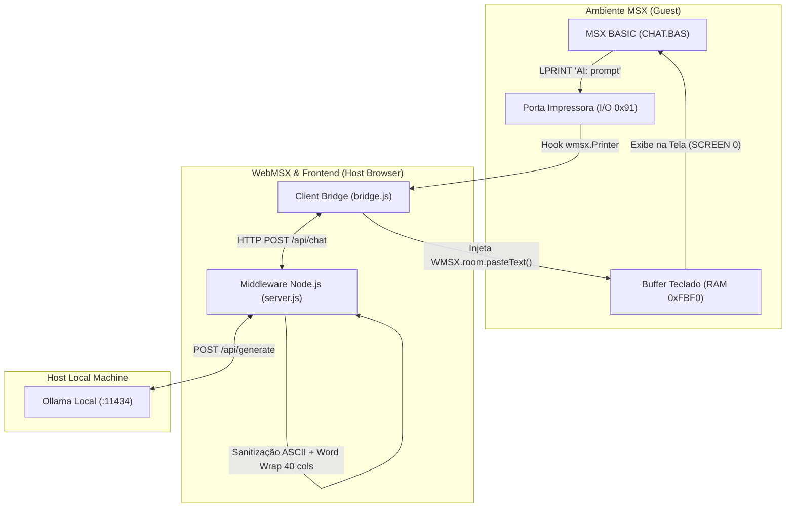

# WebMSX & Ollama LLM Bridge 🕹️🤖

Solução completa de integração retrocomputacional entre o emulador **WebMSX** (executando MSX BASIC) e modelos de linguagem locais rodando via **Ollama**, utilizando um middleware em **Node.js**.

---

## 📐 Arquitetura da Solução



---

## 🚀 Passo a Passo de Instalação e Uso

### 1. Configurar o CORS no Ollama

Para permitir que o Node.js e aplicações web locais se comuniquem com o Ollama sem restrições de Cross-Origin, configure a variável de ambiente `OLLAMA_ORIGINS`:

#### No Linux / macOS:
```bash
# Se rodar via terminal diretamente:
export OLLAMA_ORIGINS="*"
ollama serve

# Se o Ollama roda como serviço systemd (Linux):
sudo systemctl edit ollama.service
# Adicione sob a seção [Service]:
# Environment="OLLAMA_ORIGINS=*"
sudo systemctl daemon-reload
sudo systemctl restart ollama
```

#### No Windows (PowerShell):
```powershell
$env:OLLAMA_ORIGINS="*"
ollama serve
```

#### Baixar um modelo no Ollama (caso ainda não tenha):
```bash
ollama pull llama3
# ou modelos mais leves e rápidos:
ollama pull phi3
ollama pull mistral
```

---

### 2. Instalar as Dependências do Projeto Node.js

No diretório do projeto:

```bash
npm install
```

---

### 3. Iniciar o Servidor Middleware

```bash
# Iniciar em modo produção:
npm start

# Ou modo desenvolvimento (hot-reload):
npm run dev
```

O terminal exibirá:
```text
====================================================
  MSX - OLLAMA BRIDGE SERVER
  Servidor rodando em: http://localhost:3000
  Ollama Alvo:        http://127.0.0.1:11434
====================================================
```

---

### 4. Executar e Testar no Navegador

1. Abra seu navegador em: **`http://localhost:3000`**
2. Aguarde o boot do WebMSX (tela azul com o logo MSX).
3. Clique no botão **⚡ Auto-Carregar CHAT.BAS** no painel de controle.
   - O script injetará o código BASIC e executará o comando `RUN`.
4. No MSX, digite sua pergunta no prompt `MSX>` e pressione **ENTER**.
5. O comando `LPRINT` enviará o prompt ao Ollama. A resposta tratada em 40 colunas será injetada e impressa diretamente na tela do MSX!

---

## 🛠️ Detalhes dos Componentes

### 1. Middleware Node.js (`server.js`)
- **Sanitização de Caracteres**: O MSX padrão possui a tabela de caracteres ASCII de 7 bits (códigos 32 a 126). O middleware decompõe acentos Unicode (`á` $\rightarrow$ `a`, `ç` $\rightarrow$ `c`, `ñ` $\rightarrow$ `n`), converte aspas tipográficas (`“”` $\rightarrow$ `""`) e descarta emojis.
- **Word-Wrap Estrito para SCREEN 0 (40 Colunas)**: O algoritmo quebra o texto em no máximo 38 caracteres por linha, respeitando limites de palavras para uma leitura limpa sem quebrar termos no meio da linha.
- **Endpoints**:
  - `GET /api/health`: Verifica status da conexão com o Ollama e lista modelos instalados.
  - `POST /api/chat`: Recebe `{ prompt, model, maxCols }` e devolve `{ success, formattedResponse, lines, durationMs }`.

### 2. JavaScript Client Bridge (`public/bridge.js`)
- **Hook de Impressora (`LPRINT`)**: Intercepta as chamadas de saída da impressora virtual do WebMSX (`wmsx.Printer`).
- **Injeção de Teclado**: Utiliza `WMSX.room.pasteText()` para enviar comandos e a resposta do LLM diretamente para a fila de teclado da máquina emulada.

### 3. Código MSX BASIC (`msx/CHAT.BAS`)
```basic
10 REM MSX OLLAMA AI ASSISTANT
50 COLOR 15,4,4: SCREEN 0: WIDTH 40: CLS
60 PRINT "========================================"
70 PRINT "     MSX - OLLAMA AI ASSISTANT v1.0    "
80 PRINT "========================================"
100 PRINT "Digite sua pergunta (ou 'FIM' p/ sair)."
120 PRINT
130 PRINT "MSX>";
140 INPUT " "; P$
150 IF P$="" THEN GOTO 120
160 IF P$="FIM" OR P$="fim" THEN GOTO 300
170 PRINT ">> Consultando Ollama no Host... "
180 LPRINT "AI:" + P$
280 GOTO 120
300 CLS: PRINT "Sessao encerrada.": END
```

---

## 🧪 Testando a API via cURL

Você também pode testar o backend diretamente via terminal:

```bash
curl -X POST http://localhost:3000/api/chat \
  -H "Content-Type: application/json" \
  -d '{"prompt": "Explique o que e o computador MSX em poucas palavras", "model": "llama3"}'
```

---

## 📁 Estrutura do Projeto

```
.
├── package.json          # Manifesto do projeto Node.js
├── server.js             # Middleware Express + Ollama + Formatador MSX
├── README.md             # Documentação principal
├── msx/
│   ├── CHAT.BAS          # Código-fonte MSX BASIC com LPRINT
│   └── README_MSX.md     # Detalhes de I/O de baixo nível
└── public/
    ├── index.html        # Dashboard com WebMSX embutido
    ├── style.css         # Estilização Retro/Cyberpunk
    ├── bridge.js         # Script JS com hooks do WebMSX
    └── chat.bas          # Cópia para injeção automática
```
